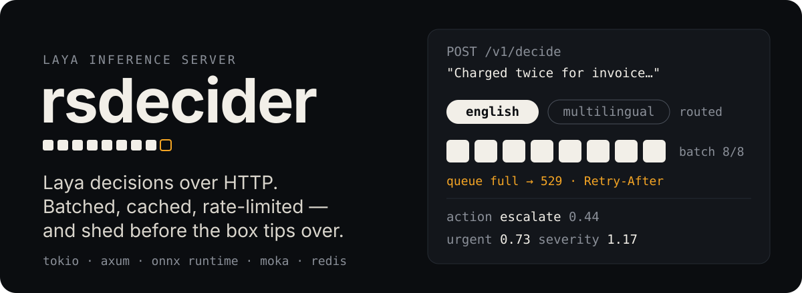
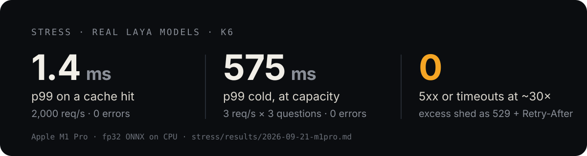
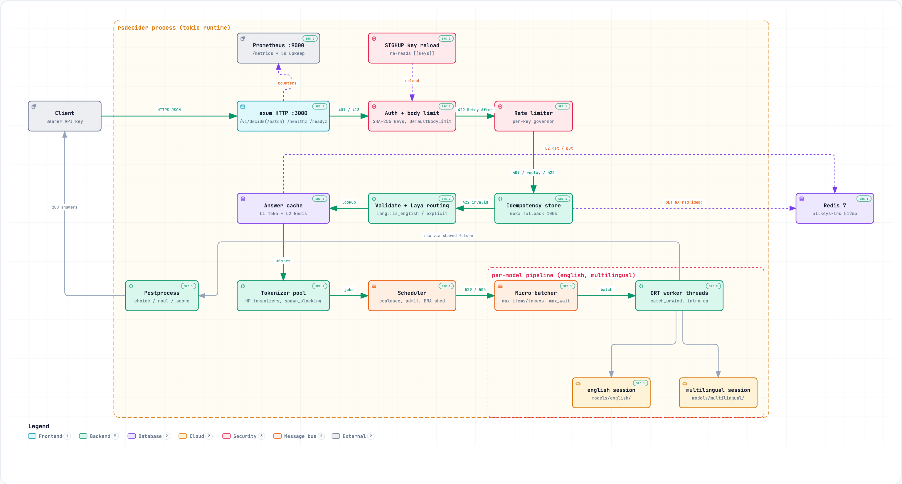
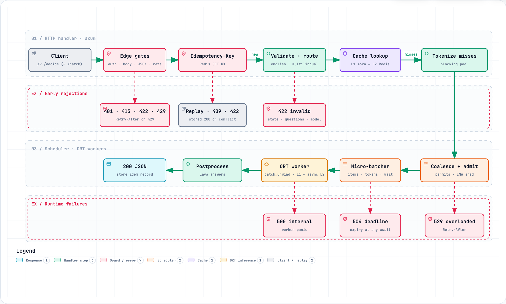

<p align="center">
  
</p>

<p align="center">
  <a href="https://github.com/House-of-Imaginations/rsdecider-inference/actions/workflows/test.yml"></a> <a href="https://github.com/House-of-Imaginations/rsdecider-inference/actions/workflows/clippy.yml"></a> <a href="https://github.com/House-of-Imaginations/rsdecider-inference/actions/workflows/fmt.yml"></a> <a href="https://github.com/House-of-Imaginations/rsdecider-inference/actions/workflows/redis.yml"></a> <a href="https://github.com/House-of-Imaginations/rsdecider-inference/actions/workflows/docker.yml"></a> <a href="https://github.com/House-of-Imaginations/rsdecider-inference/actions/workflows/openapi.yml"></a>
</p>

<p align="center">
  <a href="https://www.rust-lang.org"></a>
  <a href="https://tokio.rs"></a>
  <a href="https://github.com/tokio-rs/axum"></a>
  <a href="https://onnxruntime.ai"></a>
  <a href="https://redis.io"></a>
  <a href="./openapi.yaml"></a>
  <a href="./self-hosted"></a>
  <a href="https://github.com/NandhaKishorM/laya"></a>
</p>

<p align="center">
  <a href="#quick-start">Quick start</a> ·
  <a href="#endpoints">Endpoints</a> ·
  <a href="#configure-rsdecidertoml">Configuration</a> ·
  <a href="#self-hosted-docker">Self-hosted</a> ·
  <a href="#how-it-works">How it works</a> ·
  <a href="./openapi.yaml">OpenAPI</a>
</p>

**rsdecider** is a Rust (tokio + axum) server for [Laya](https://github.com/NandhaKishorM/laya) decision models: you send a
situation (`state`) and a few structured questions, and it returns calibrated choices, yes/no probabilities and scores.
It routes each request to Laya's English or multilingual model, batches work onto ONNX Runtime, caches every answer, and
rejects early with `529` when the machine is full instead of letting latency explode.

```bash
curl -s localhost:3000/v1/decide -H 'authorization: Bearer dev-key' -H 'content-type: application/json' -d '{
  "state": "Customer was charged twice for invoice #4411 and is asking for a refund.",
  "questions": {
    "action":   {"type": "choice", "instructions": "How should support handle this?",
                 "criteria": {"approve": "issue the refund", "deny": "refuse the refund", "escalate": "send to a human agent"}},
    "urgent":   {"type": "noul",   "instructions": "Is this urgent?"},
    "severity": {"type": "score",  "instructions": "How severe is the issue?", "criteria": ["low", "medium", "high"]}
  }}'
```

<details>
<summary><b>Response</b> — real output from <code>laya-english</code> (click to expand)</summary>

```json
{
  "id": "req_01M31BAVX63WFSFXX0WQWM0FAK",
  "model": "laya-english@c3e0839d173a",
  "answers": {
    "action":   { "type": "choice", "choice": "escalate",
                  "probabilities": { "approve": 0.4047, "deny": 0.1535, "escalate": 0.4417 },
                  "confidence": 0.0764, "action": { "act_probability": 1.0 }, "cached": false },
    "urgent":   { "type": "noul", "noul": 0.7262, "confidence": 0.7262,
                  "action": { "act_probability": 1.0 }, "cached": false },
    "severity": { "type": "score", "score": 1.1731, "legend": { "0": "low", "1": "medium", "2": "high" },
                  "probabilities": { "0": 0.1098, "1": 0.6073, "2": 0.2829 },
                  "confidence": 0.1784, "action": { "act_probability": 1.0 }, "cached": false }
  },
  "usage":     { "input_tokens": 140, "output_tokens": 0 },
  "routing":   { "model": "english", "reason": "detected:english" },
  "timing_ms": { "tokenize": 6.8, "wait": 582.6, "total": 589.4 }
}
```

The same request again returns in `0.1 ms` with `"cached": true`. A Vietnamese `state` goes to
`laya-multilingual` with `"reason": "detected:non_english"`.
</details>

<p align="center">
  
</p>

## What you get

| | |
|---|---|
| **Laya routing mode** | Script/language detection sends English to `english`, everything else to `multilingual`; `"model"` overrides it. |
| **Controlled concurrency** | Bounded tokenize queue and per-model queues (`max_pending`), all-or-nothing admission, deadline-aware shedding (`529` + `Retry-After`) and a fixed ORT thread budget sized to your CPUs. |
| **Micro-batching** | Questions from concurrent requests are packed into padded batches, grouping similar lengths together (oldest first) to keep padding low (`max_batch_items`, `max_batch_tokens`, `max_wait_ms`). |
| **Coalescing** | 100 identical in-flight questions run the model once. |
| **Two-tier cache** | L1 in-process (moka, byte-bounded) and optional L2 Redis shared across instances. |
| **API keys + rate limits** | Only SHA-256 hashes live in config; per-key token bucket (`rps`, `burst`), a batch costs one token per item. `kill -HUP` reloads `[[keys]]` without a restart. |
| **Idempotency** | `Idempotency-Key` replays the stored response; Redis `SET NX` across instances, byte-bounded in-process fallback. |
| **Operability** | Prometheus metrics, `/healthz` + `/readyz`, request ids in logs and `x-request-id`, worker panics isolated. |

## Quick start

> [!IMPORTANT]
> You need Rust 1.85+ (edition 2024) and Python 3.10+ for the one-time model export. Docker is only needed for
> `self-hosted/` and the Redis/e2e test suites; [k6](https://k6.io) only for `stress/`.

**1. Export the models** (once; needs Python 3.10+). Writes `models/<name>/{model.onnx, tokenizer.json, laya.json,
fixtures.json, manifest.json}` and self-checks ONNX Runtime against PyTorch. (Or download them, see
[Getting the models](#getting-the-models).)

```bash
python3 -m venv .venv && .venv/bin/pip install -r tools/requirements.txt
.venv/bin/python tools/export_onnx.py --out models/english
.venv/bin/python tools/export_onnx.py --subfolder multilingual --out models/multilingual
```

**2. Create an API key and a config.**

```bash
cargo build --release
./target/release/rsdecider hash-key 'my-secret-key'      # → paste into [[keys]].sha256
cp rsdecider.example.toml rsdecider.toml
```

**3. Run it.**

```bash
./target/release/rsdecider serve --config rsdecider.toml
curl localhost:3000/readyz                                 # → ready
```

### Getting the models

Each model folder carries a `manifest.json` (size + SHA-256 of every file, written last by the export). Either export
the models (step 1 above), or set `download` on a `[[models]]` entry to a base URL serving an exported folder
(`<download>/manifest.json`, `<download>/model.onnx`, …) and let rsdecider fetch it:

```bash
rsdecider models check --config rsdecider.toml             # full size + SHA-256 check; non-zero exit if anything is off
rsdecider models pull  --config rsdecider.toml             # download missing/corrupt files (--model english for one)
```

`serve` checks file sizes before loading. If a folder is missing or broken and has a `download` URL, it asks on a
terminal (`Download 568 MB from …? [y/N]`); with `--download-models` or `RSDECIDER_DOWNLOAD_MODELS=1` it downloads
without asking; otherwise it exits with the export command. Folders exported before manifests existed still load
(`ok (no manifest, not verified)`).

> [!NOTE]
> The shipped configs leave `download` commented out: exports aren't published yet. Point it at wherever you host
> an exported folder (any HTTP(S) server, e.g. a Hugging Face `resolve/<revision>/english` path). Pin `<revision>` to a
> commit SHA: the hashes come from the same host, so the manifest catches transport errors, not a compromised host.

## Endpoints

| Method | Path | Auth | Purpose |
|---|---|---|---|
| `POST` | `/v1/decide` | Bearer key | Answer every question about one `state`. |
| `POST` | `/v1/decide/batch` | Bearer key | `{"items": [ …decide bodies… ]}` — up to `limits.max_batch_states` states, each routed on its own. Returns `{"id", "results": [...]}`. |
| `GET` | `/healthz` | — | Liveness: `ok`. |
| `GET` | `/readyz` | — | `ready` while every model has a live worker, else `503`. |
| `GET` | `/docs` | — | Swagger UI — browse the API and try requests (click **Authorize**, paste your key). |
| `GET` | `/openapi.yaml` | — | The OpenAPI 3.1 document, embedded in the binary. |
| `GET` | `:9000/metrics` | — | Prometheus exposition (separate listener, `server.metrics_listen`). |

Full schema: **[`openapi.yaml`](./openapi.yaml)** (OpenAPI 3.1), also served live at `http://localhost:3000/docs` and
`/openapi.yaml` for Postman or SDK generators.

> [!NOTE]
> `/docs` loads Swagger UI from jsDelivr, so it needs internet access in the browser. The API itself has no external
> dependencies.

<details>
<summary><b>Question types</b></summary>

| `type` | `criteria` | Answer fields |
|---|---|---|
| `choice` | list `["a","b"]` or map `{"label": "description"}` | `choice`, `probabilities` per label, `confidence` |
| `score` | ordered list, e.g. `["low","medium","high"]` | `score` (expected index), `legend`, `probabilities`, `confidence` |
| `noul` | optional map, e.g. `{"true": "..."}` | `noul` (probability of yes), `confidence` |

Every answer also carries `action.act_probability` and `cached`. `state` and `instructions` may be strings or any JSON value.
</details>

<details>
<summary><b>Status codes</b></summary>

Errors are `{"error": {"code", "message"}}`. Checks run in this order:

| Status | `code` | When |
|---|---|---|
| `401` | `unauthorized` | Missing or unknown bearer key |
| `413` | `payload_too_large` | Body over `limits.max_body_bytes` |
| `422` | `invalid_request` | Bad JSON/field (message names the path, e.g. `items[1].`), unknown model, non-ASCII `Idempotency-Key`, key reused with a different body |
| `429` | `rate_limited` | Per-key bucket empty — honour `Retry-After` |
| `409` | `idempotency_in_progress` | Same `Idempotency-Key` still running — honour `Retry-After` |
| `529` | `overloaded` | Tokenize queue full, or the model queue can't finish this work before the deadline — honour `Retry-After` |
| `504` | `deadline_exceeded` | Passed `server.request_timeout_ms` |
| `500` | `internal` | Inference failed (e.g. worker panic); the next request is served normally |
</details>

## Configure `rsdecider.toml`

Start from [`rsdecider.example.toml`](./rsdecider.example.toml). Only `[routing]` and `[[models]]` are required
(with no `[[keys]]`, every call gets `401`), so a minimal file is:

```toml
[routing]
english_model = "english"
non_english_model = "multilingual"

[[models]]
name = "english"
path = "models/english"

[[models]]
name = "multilingual"
path = "models/multilingual"

[[keys]]
name = "my-app"
sha256 = "<output of: rsdecider hash-key my-secret-key>"
rps = 50
burst = 100
```

<details open>
<summary><b>Every option, with defaults</b></summary>

```toml
[server]
listen             = "0.0.0.0:3000"
metrics_listen     = "127.0.0.1:9000"   # Prometheus; keep it private
worker_threads     = 2                  # tokio threads for HTTP (>= 1)
tokenize_threads   = 2                  # concurrent tokenizations on the blocking pool
request_timeout_ms = 10000              # end-to-end deadline → 504

[limits]
max_body_bytes          = 1048576       # → 413
max_state_chars         = 100000        # → 422
max_batch_states        = 8             # items per /v1/decide/batch
max_questions_per_state = 16

[routing]                               # Laya routing mode
english_model     = "english"           # must name a [[models]] entry
non_english_model = "multilingual"

[[models]]                              # one table per model
name               = "english"
path               = "models/english"   # model.onnx + tokenizer.json + laya.json
download           = "https://…/english"  # optional: base URL for `models pull` / first-run download (none by default)
execution_provider = "cpu"              # or "cuda" (build with --features cuda)
workers            = 1                  # ORT sessions, one blocking thread each
intra_op_threads   = 6                  # threads per session
max_pending        = 256                # queued questions before 529 (memory bound)
max_batch_items    = 8                  # questions per forward pass
max_batch_tokens   = 8192               # padded tokens per forward pass
max_wait_ms        = 2                  # how long a batch waits to fill

[cache]
l1_max_bytes         = 268435456        # in-process answer cache (256 MiB)
l1_ttl_secs          = 3600
redis_url            = "redis://127.0.0.1:6379"   # optional: enables L2 + shared idempotency
l2_ttl_secs          = 86400
idempotency_ttl_secs = 86400

[[keys]]                                # one table per client
name   = "my-app"                       # shows up in metrics and logs
sha256 = "…64 lowercase hex…"           # rsdecider hash-key <secret>
rps    = 50                             # sustained questions/s (batch items count individually)
burst  = 100

[knobs]                                 # advanced; every field optional (src/knobs.rs)
# tokenize_queue             = 512      # requests tokenizing or waiting → 529 when full (default Σ max_pending)
overloaded_retry_after_secs  = 1        # Retry-After on 529
redis_timeout_ms             = 250      # per Redis command; then cache miss / local idempotency
idempotency_local_max_bytes  = 67108864 # in-process idempotency store (64 MiB)
idempotency_max_stored_bytes = 262144   # larger responses re-run on repeat (256 KiB)
# ort_global_threads          = 4       # one shared ORT intra-op pool for every session; per-model intra_op_threads then ignored
```

The server refuses to start on an invalid file (unknown routing target, duplicate names, zero workers, bad key hash)
and names the offending field. Edit `[[keys]]` and send `SIGHUP` to add, rotate or revoke keys live (other sections need a restart).
</details>

### Tuning

Every request passes three bounded stages: **tokenize → model queue → ORT workers**. Size the thread budget to your CPUs
first, then set the queues from the throughput you measure (the `rsdecider_*` metrics on `:9000`, or `stress/run.sh`).

| Knob | Controls | Raise it when | Lower it when |
|---|---|---|---|
| `models.intra_op_threads` | Threads per forward pass (latency of one batch) | a model is busy and cores are idle | the CPU is oversubscribed |
| `models.workers` | Parallel ORT sessions per model (one model copy each) | single-batch latency is fine but throughput isn't | memory is tight — each worker loads the model again |
| `server.tokenize_threads` | Concurrent tokenizations | requests wait in tokenize while models are idle | ORT needs those cores |
| `server.worker_threads` | tokio threads for HTTP, JSON and cache hits | cache-hit throughput is CPU-bound | almost all traffic is cold inference |
| `models.max_batch_items` | Questions per forward pass | under load, to amortise each pass | p99 at low load matters more than throughput |
| `models.max_batch_tokens` | Padded tokens per pass (memory per batch) | long inputs split into tiny batches | batches spike memory |
| `models.max_wait_ms` | How long a batch waits to fill | traffic is steady and batches leave half-empty | traffic is sparse (latency is added to every cold request) |
| `models.download` | Base URL `models pull` and first-run `serve` fetch this folder from | — | — |
| `models.max_pending` | Queued questions before `529`; the sum across models also caps requests waiting to tokenize | legitimate bursts get `529` while the deadline still has room | memory is tight, or you want to shed earlier |
| `server.request_timeout_ms` | End-to-end deadline, and so how much queueing admission allows | clients can wait longer | clients should fail fast and retry elsewhere |
| `keys.rps` / `keys.burst` | Per-client share of capacity (a batch item costs one token) | a client is throttled below what the box can serve | one client can crowd out others |
| `cache.l1_max_bytes` / `l1_ttl_secs` | In-process answer cache | repeats miss because entries were evicted | memory is tight |
| `cache.redis_url` | Shared L2 cache and idempotency across instances | you run more than one instance | — |

- **CPU budget:** `Σ(workers × intra_op_threads) + tokenize_threads + worker_threads ≈ vCPUs`. With
  `knobs.ort_global_threads = n`, the ORT term is `Σ workers + n − 1`: the pool has n − 1 threads and every running
  batch's calling thread computes too. Giving the busier model
  more `intra_op_threads` usually beats adding `workers`. The 10-core M1 Pro stress config uses english `6`,
  multilingual `2`, tokenize `1`, HTTP `2` ([`stress/rsdecider.stress.toml`](./stress/rsdecider.stress.toml)).
- **`max_pending ≈ items/s × 1–2 s`.** Latency is protected separately: admission estimates queue time from tokens, not
  items (EMA seconds/token × (tokens already queued + this request's own) ÷ workers), and returns `529` up front when
  the work can't finish by the deadline.
- **Biggest lever:** cold capacity is inference-bound, so the model beats any server knob — a GPU
  (`cargo build --release --features cuda`, `execution_provider = "cuda"`) today; a w8 export is a memory/latency
  trade-off, not a free win (see Small machines below).

**Advanced `[knobs]`** ([`src/knobs.rs`](./src/knobs.rs)): rarely needed, but tunable without a rebuild.

| Knob | Default | Tune it when |
|---|---|---|
| `knobs.tokenize_queue` | `Σ max_pending` | you want to shed before tokenization sooner (tight memory, large bodies) or later |
| `knobs.overloaded_retry_after_secs` | `1` | clients should back off longer after a `529` |
| `knobs.redis_timeout_ms` | `250` | Redis is remote or slow (raise) or you'd rather miss fast (lower) |
| `knobs.idempotency_local_max_bytes` | 64 MiB | no Redis and many `Idempotency-Key` clients |
| `knobs.idempotency_max_stored_bytes` | 256 KiB | responses are large and must still replay |
| `knobs.ort_global_threads` | per-session `intra_op_threads` | CPU is scarce — one shared ORT intra-op pool (n − 1 threads plus each running batch's caller) across every session instead of one pool per session |

### Small machines

[`self-hosted/rsdecider.small.toml`](./self-hosted/rsdecider.small.toml) is a starting point for 2–4 vCPU / 4 GB
boxes: 1 worker per model, 1 tokenize thread, 1 HTTP worker thread, `[knobs] ort_global_threads = 2` for any box in
that 2–4 vCPU range, and smaller `max_batch_tokens` / `max_pending` so a burst can't blow the memory budget. The
startup thread-budget warning is expected on this profile: it counts the worst case, both models running at once
plus the mostly idle HTTP and tokenize threads, so it fires even though the machine isn't actually oversubscribed
in normal operation. Copy it and mount your models.

**RAM floor:** loading both fp32 models takes about 2.9 GB, and that's without Redis (512 MB in
`self-hosted/docker-compose.yml`) or the 256 MiB in-process L1 cache — count those in if you run them on the same
host, and plan closer to 4 GB just for the models. With 2 GB, load only one model (drop the `[[models]]` table you
don't need and point `[routing]` at the one you keep).

**w8 (opt-in, not the default):** `tools/export_onnx.py --quantize w8` runs 8-bit weight-only quantization (ORT
`MatMulNBitsQuantizer`, block_size=128, symmetric, accuracy_level=4) behind the same decision gate as int8 (below).
On an M1 Pro, w8 cuts single-batch English inference 267 → 170 ms p50 and peak server RSS 3.0 → 1.05 GB; files shrink
1,608 → 564 MB (English) and 1,229 → 874 MB (multilingual) — roughly 3x less memory; x86 not measured yet. It is not
the shipped default because the gate is a real check, not a formality: on the fixture set English currently **fails**
it — `max |Δp| 0.0731` on an ambiguous three-way severity call ("ok" vs "warning" near a tie) — while multilingual
passes. Use it anyway with `--quantize w8 --force`, which still writes the quantized model after printing the gate
numbers and a warning; `self-hosted/rsdecider.small.toml` stays pointed at the fp32 paths.

**int8:** `tools/export_onnx.py --quantize int8` (dynamic per-tensor quantization) exists and uses the same decision
gate. Today's models fail it — dynamic int8 gets top-1 agreement of 12/18 (English) and 14/19 (multilingual) against
fp32 on the fixture questions — so int8 is not recommended. Calibrated static int8, fp16 and quantization-aware
training are future options that might pass the gate.

**Decision gate** (`tools/export_onnx.py`, both `int8` and `w8`): a quantized export only replaces `model.onnx` if,
against the fp32 reference on every fixture question, `|Δp| <= 0.05` and `|Δ act_prob| <= 0.05`, and top-1 matches on
every *decisive* question — one where the fp32 top-2 probability margin is `> 0.10` (or there's only one option).
With `|Δp| <= 0.05` per option, a flip is only possible when the margin is `<= 0.10`, so a flip there is a tie broken
differently, not damage. `--force` bypasses a failed gate for a single export run; it never changes the thresholds.

## Self-hosted (Docker)

Everything for a container deployment lives in [`self-hosted/`](./self-hosted): a two-stage `Dockerfile`, a
`docker-compose.yml` with Redis (512 MB, LRU), and the container config `rsdecider.toml`.

```bash
cd self-hosted
docker compose --profile export up models-export   # once: exports missing models into ../models (slow, ~GBs)
docker compose up --build
curl localhost:3000/readyz
```

`models-export` is opt-in (`profiles: ["export"]`): it installs `tools/requirements.txt` in a Python container and
exports english and multilingual only where `manifest.json` (written last) is missing (Hugging Face cache in the `hf-cache` volume).
rsdecider runs with `--download-models`, so once `download` URLs are set in `rsdecider.toml` it fetches missing models
on start instead. Compose mounts `../models` writable at `/models` and `self-hosted/rsdecider.toml` at `/etc/rsdecider/rsdecider.toml`;
edit that file (keys, threads, `max_pending`) and restart. Metrics are published on `127.0.0.1:9000` only.

> [!WARNING]
> `self-hosted/rsdecider.toml` ships with the demo keys `dev-key` and `stress-key`. Replace them before exposing the port.

### Monitoring

`docker compose up` also starts Prometheus (scraping `:9000/metrics` every 5s, no exposed port) and Grafana at
[http://127.0.0.1:3001](http://127.0.0.1:3001) (`admin`/`admin`), pre-provisioned with a **rsdecider** dashboard:
request rate and latency (p50/p95/p99), sheds, 504/5xx rate, queue depth, inference latency and batch size by model,
cache hit ratio, coalescing, padding waste, tokens/s, and Redis/orphaned-inference errors. `/metrics` itself stays on
`127.0.0.1:9000`, unchanged.

## How it works

<picture>
  <source media="(prefers-color-scheme: dark)" srcset="./assets/readme/system-dark.png">
  
</picture>

A request is authenticated, parsed, charged against its key's rate limit and checked for an `Idempotency-Key`. It is
then routed to a model, and each question is looked up in the cache — only misses are tokenized and sent to the
scheduler. The scheduler joins identical in-flight questions, admits the rest all-or-nothing against the model's queue
(shedding with `529` when the deadline can't be met), and a per-model micro-batcher feeds padded batches to blocking ONNX
Runtime workers. Answers are post-processed into Laya's format, written to L1 and (asynchronously) Redis, and returned.

<picture>
  <source media="(prefers-color-scheme: dark)" srcset="./assets/readme/request-flow-dark.png">
  
</picture>

> [!TIP]
> Interactive versions (pan, zoom, search, trace a path, export): [`docs/diagrams/system.html`](./docs/diagrams/system.html)
> and [`docs/diagrams/request-flow.html`](./docs/diagrams/request-flow.html) — open locally in a browser. Sources are the
> neighbouring `*.json` files ([archify](https://github.com/tt-a1i/archify) specs).

## Performance

Measured with k6 against the real fp32 models on an Apple M1 Pro (10 cores), CPU execution provider, no Redis.

| Scenario | Result |
|---|---|
| Cache hits, 3,000 req/s offered | 2,000 req/s served, p99 **1.4 ms**, 0 errors |
| Cold, 3 req/s × 3 questions | p99 **518 ms**, 0 errors |
| Cold, 6 req/s | 15% shed as `529`, accepted p99 6.5 s (inside the 10 s deadline) |
| Overload, 100 req/s (~30× capacity) | only `200` and `529` — **0 timeouts, 0 5xx**, queue drains to 0, ~6% padding |
| 90k-char states, 40–200 req/s | model queue sheds the excess as `529`, peak RSS 2.2 GB, 0.4–0.5% of accepted requests `504` |

Cold capacity is inference-bound (~10 questions/s English, ~4/s multilingual). The biggest lever is the model, not the
server: a GPU/CoreML execution provider, or an opt-in w8 export once you accept its trade-off (see Small machines
above). Full numbers:
[`stress/results/2026-09-21-m1pro.md`](./stress/results/2026-09-21-m1pro.md). Re-run with `stress/run.sh` against a
running server (`-e RATE=…` per scenario; see the script).

## Development

```bash
cargo test                                                        # unit + API tests (fake backend, no models)
MODEL_DIR=models/english cargo test --release --features parity --test parity   # ONNX vs PyTorch fixtures
cargo test --features redis-tests --test redis                    # needs Docker (testcontainers)
(cd self-hosted && docker compose up -d) && cargo test --features e2e --test e2e
./target/release/rsdecider serve --fake-delay-ms 20               # server without models, for overhead tests
```

<details>
<summary><b>Project layout</b></summary>

```text
src/
  main.rs          CLI (serve, hash-key, models check/pull), runtime + metrics setup
  api.rs           axum routes, request pipeline, errors
  docs.html        Swagger UI page served at /docs
  auth.rs          hashed API keys + per-key governor limiter
  idempotency.rs   Redis SET NX with bounded moka fallback
  lang.rs          Laya routing (English vs multilingual)
  cache.rs         L1 moka + L2 Redis answer cache
  scheduler.rs     coalescing, admission, micro-batcher, ORT worker pool
  model/           tokenization, Laya sequence encoding, ONNX session, postprocess
  config.rs        rsdecider.toml schema + validation
  download.rs      manifest.json check + model folder download
  knobs.rs         advanced [knobs] limits and their defaults
tests/             api, parity, redis, e2e suites
tools/             export_onnx.py (PyTorch → ONNX + fixtures + manifest)
stress/            k6 scenarios, runner, results
self-hosted/       Dockerfile, docker-compose.yml, container config
docs/diagrams/     archify sources + interactive HTML
openapi.yaml       HTTP API
```
</details>

## Known limits

- Batches are admitted all-or-nothing, so under contention large `/v1/decide/batch` calls lose to single requests.
- Admission costs requests per token, but under a flood of maximum-length inputs about 0.4–0.5% of accepted requests
  still hit `504` (measured with k6 on the same host; the cause is not proven).
- The Redis suite runs in CI (testcontainers); the Docker e2e suite needs exported models, so it runs locally only.
